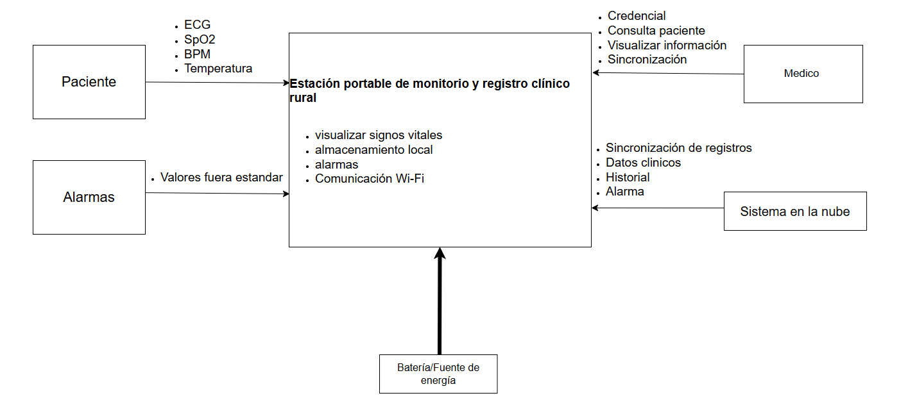
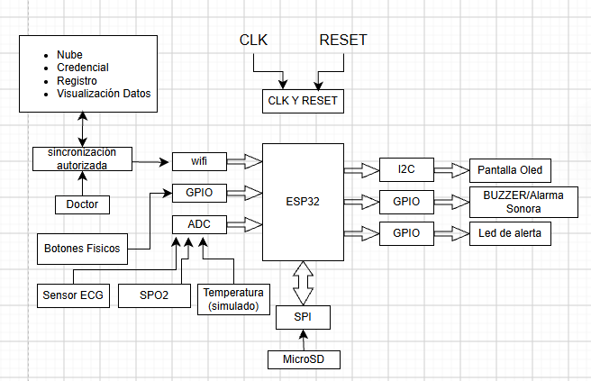
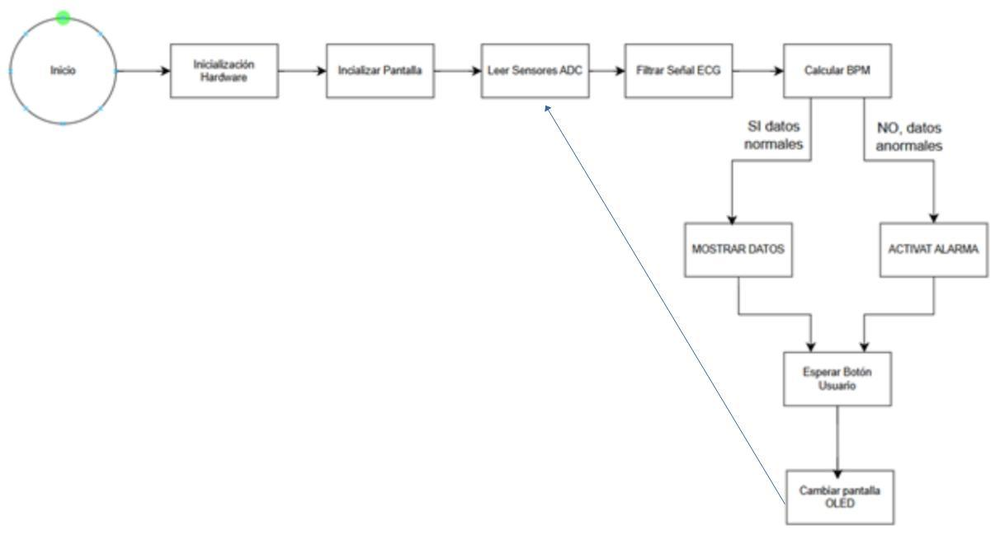
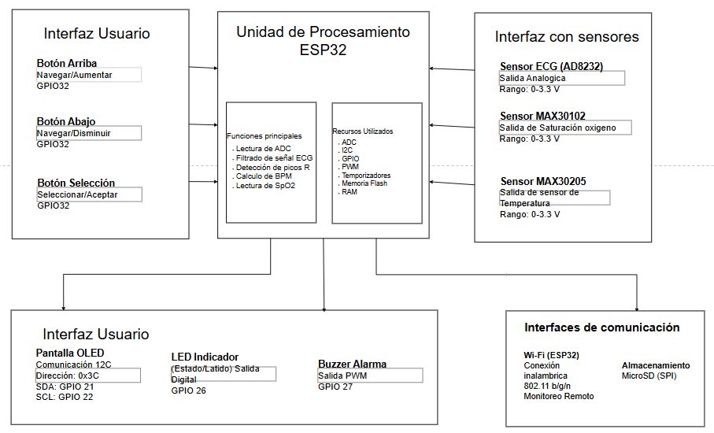

# Documento de Diseño-Estación Portable de Monitoreo y Registro Clínico Rural

Joel Alexander Parada Campoverde

## Introducción

La Estación Portable de Monitoreo y Registro Clínico Rural es un sistema embebido diseñado para apoyar la atención médica en zonas rurales donde la conectividad a Internet es limitada o inexistente.

El sistema utiliza una placa ESP32 como unidad de procesamiento para adquirir señales biomédicas provenientes de un sensor ECG y sensores simulados mediante potenciómetros para SpO₂ y temperatura corporal. La información es mostrada en una pantalla OLED, almacenada localmente y supervisada mediante alarmas visuales y sonoras cuando se detectan valores fuera de los rangos normales.

## Alcance y Limitaciones

### Alcance

El proyecto permitirá:

- Medición de señal ECG.
- Simulación de SpO₂ mediante potenciómetro.
- Simulación de temperatura mediante potenciómetro.
- Visualización de datos en pantalla OLED.
- Navegación mediante botones.
- Alarmas mediante LED y Buzzer.
- Procesamiento digital de la señal ECG.
- Funcionamiento autónomo con ESP32.

**Uso de potenciómetros para la simulación:** Los potenciómetros se utilizan como elementos de simulación durante la etapa de prototipado para representar los valores de SpO₂ y temperatura. Su finalidad es permitir la validación de la adquisición de datos, procesamiento, visualización y generación de alarmas del sistema sin depender inicialmente de sensores biomédicos reales. En una implementación posterior, estos elementos podrían ser reemplazados por sensores biomédicos reales, pero dicha implementación no forma parte del alcance actual del proyecto.

### Limitaciones

El proyecto NO contempla:

- Diagnóstico médico.
- Comunicación permanente con Internet.
- Acceso remoto desde cualquier ubicación.
- Monitoreo simultáneo de múltiples pacientes.
- Inteligencia artificial para diagnóstico.
- Integración con hospitales o sistemas HIS.

## Diagrama de contexto

## Diagrama de Bloques

La conectividad Wi-Fi del ESP32 se considera una función opcional para realizar la sincronización de los registros cuando exista conectividad y se cuente con la autorización correspondiente. El sistema no depende de una conexión permanente a Internet, manteniendo como característica principal la operación local de la estación.

## Máquina de Estados

El funcionamiento del sistema es cíclico. Después de cambiar la información mostrada en la pantalla OLED, el sistema regresa a la lectura de los sensores para continuar con el procesamiento, evaluación y monitoreo de los datos.

## Diagrama de interfaces

## Alternativa de diseño

Para seleccionar la unidad de procesamiento se consideraron diferentes plataformas de desarrollo, principalmente el ESP32, Arduino UNO y Raspberry Pi. La selección se realizó considerando las necesidades del proyecto, como el procesamiento de la señal ECG, la adquisición de datos mediante entradas ADC, la utilización de diferentes periféricos, la conectividad Wi-Fi y el funcionamiento autónomo de la estación.

Como mayores opciones de alternativas la tenemos en la placa de desarrollo teniendo las dos alternativas a continuación

### Alternativa 1: Arduino UNO

Ventajas:

- Bajo costo.
- Bajo consumo energético.
- Facilidad de programación.

Desventajas:

- Menor capacidad de memoria en comparación con el ESP32.
- No incorpora Wi-Fi de forma integrada.
- Menor cantidad de recursos disponibles para manejar simultáneamente la adquisición, procesamiento, visualización y almacenamiento del sistema.
- Para incorporar conectividad Wi-Fi sería necesario utilizar un módulo adicional.

Por estas características, aunque el Arduino UNO podría utilizarse para un prototipo básico, se considera menos conveniente para el proyecto debido a que requeriría componentes adicionales y presenta mayores limitaciones para integrar todas las funciones previstas.

### Alternativa 2: Raspberry Pi

Ventajas:

- Mayor capacidad de procesamiento.
- Mayor cantidad de recursos para ejecutar aplicaciones complejas.
- Puede manejar diferentes interfaces y servicios de red.

Desventajas:

- Mayor consumo energético en comparación con una plataforma como el ESP32.
- Mayor costo y complejidad para el objetivo planteado.
- Requiere un sistema operativo para su funcionamiento.
- Sus capacidades de procesamiento son superiores a las necesarias para las funciones definidas en este prototipo.
- Por estas razones, aunque la Raspberry Pi ofrece mayores prestaciones, no resulta necesaria para el alcance actual del proyecto, ya que se busca una estación embebida portátil y autónoma.

## Selección del ESP32

Finalmente, se selecciona el ESP32 como unidad principal de procesamiento debido a que ofrece un equilibrio adecuado entre capacidad de procesamiento, memoria, consumo energético, periféricos y conectividad. La plataforma dispone de entradas ADC necesarias para adquirir la señal ECG y los valores simulados de SpO₂ y temperatura, además de GPIO para los botones, LED y buzzer.

También incorpora conectividad Wi-Fi, lo que permite contemplar una futura sincronización autorizada de los registros sin necesidad de agregar un módulo externo. Su capacidad de procesamiento permite realizar el filtrado y procesamiento digital de la señal ECG, controlar la pantalla OLED y gestionar el almacenamiento local.

Por lo tanto, el ESP32 resulta la alternativa más adecuada para el objetivo del proyecto, ya que permite integrar las funciones requeridas manteniendo una solución embebida, portátil y con una complejidad acorde al alcance definido.

## Consideraciones Éticas

### Riesgos

- Uso indebido como dispositivo médico certificado.
- Interpretación incorrecta de los resultados.
- Posibles errores de medición.
- Riesgos relacionados con la privacidad de los datos clínicos.

### Medidas de mitigación

- Indicar claramente que el sistema es un prototipo académico y no reemplaza equipos médicos certificados.
- Incorporar advertencias en la interfaz para evitar diagnósticos basados únicamente en el dispositivo.
- Mantener los datos almacenados localmente y sincronizarlos únicamente bajo autorización del personal médico. Estas decisiones son coherentes con el objetivo del proyecto de priorizar la operación local en entornos con conectividad limitada.
- Proteger el acceso a los registros clínicos mediante un PIN o credencial local antes de consultar o gestionar la información almacenada.
